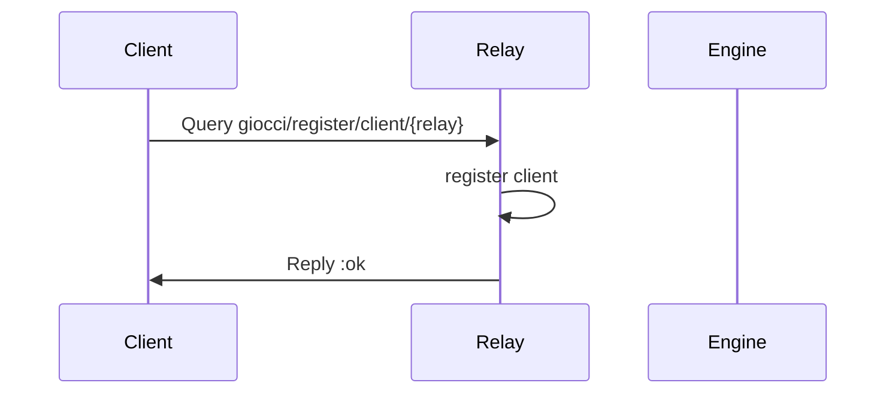
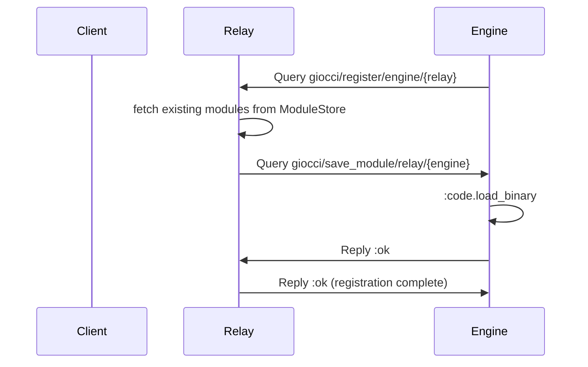
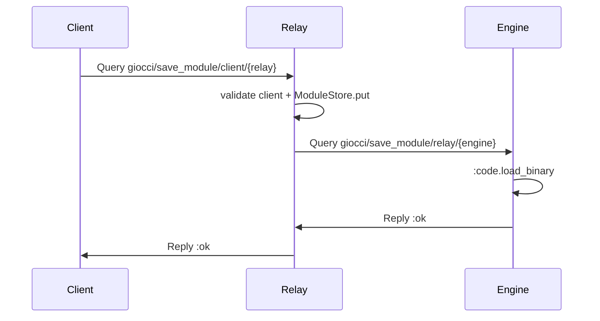
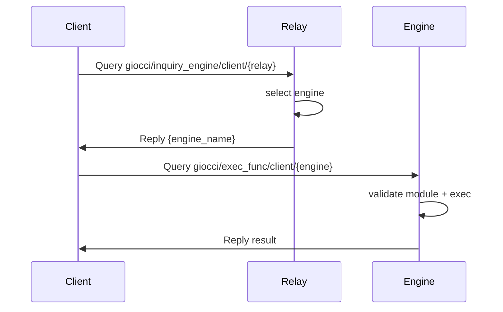
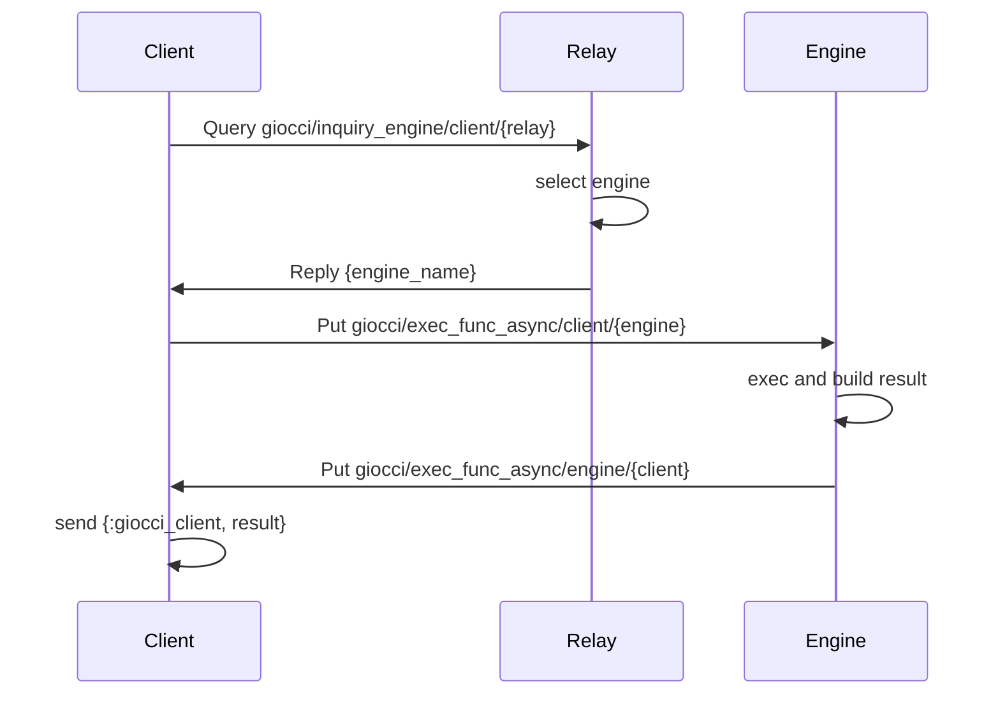

# Giocci Communication Flow

This repository communicates over Zenohex (Zenoh) using Query/Reply and Pub/Sub. The sections below summarize the key paths and the main sequences.

## Components

- Client: `apps/giocci_client`
- Relay: `apps/giocci_relay`
- Engine: `apps/giocci_engine`
- Transport: Zenohex (Zenoh) session

## Key Map

- Client registration: `giocci/register/client/{relay_name}`
- Engine registration: `giocci/register/engine/{relay_name}`
- Save module (Client -> Relay): `giocci/save_module/client/{relay_name}`
- Distribute module (Relay -> Engine): `giocci/save_module/relay/{engine_name}`
- Engine inquiry: `giocci/inquiry_engine/client/{relay_name}`
- Sync exec request: `giocci/exec_func/client/{engine_name}`
- Async exec request (Engine subscribes): `giocci/exec_func_async/client/{engine_name}`
- Async exec result (Client subscribes): `giocci/exec_func_async/engine/{client_name}`
- If `key_prefix` is set, it is prepended (e.g., `prefix/giocci/...`).

## Flows

### 1) Client Registration

### 2) Engine Registration + Existing Module Distribution

### 3) Save Module (Client -> Relay -> Engine)

### 4) Sync Execution (Client -> Relay -> Engine -> Client)

### 5) Async Execution (Client -> Relay -> Engine -> Client)

## Notes

- Client <-> Relay uses Query/Reply; Engine uses Queryable for sync and Subscriber/Publisher for async.
- All communication is via Zenohex key space; `key_prefix` may be prepended.
- Engine selection is currently first-registered in `GiocciRelay.EngineRegistrar.select_engine/0`.
